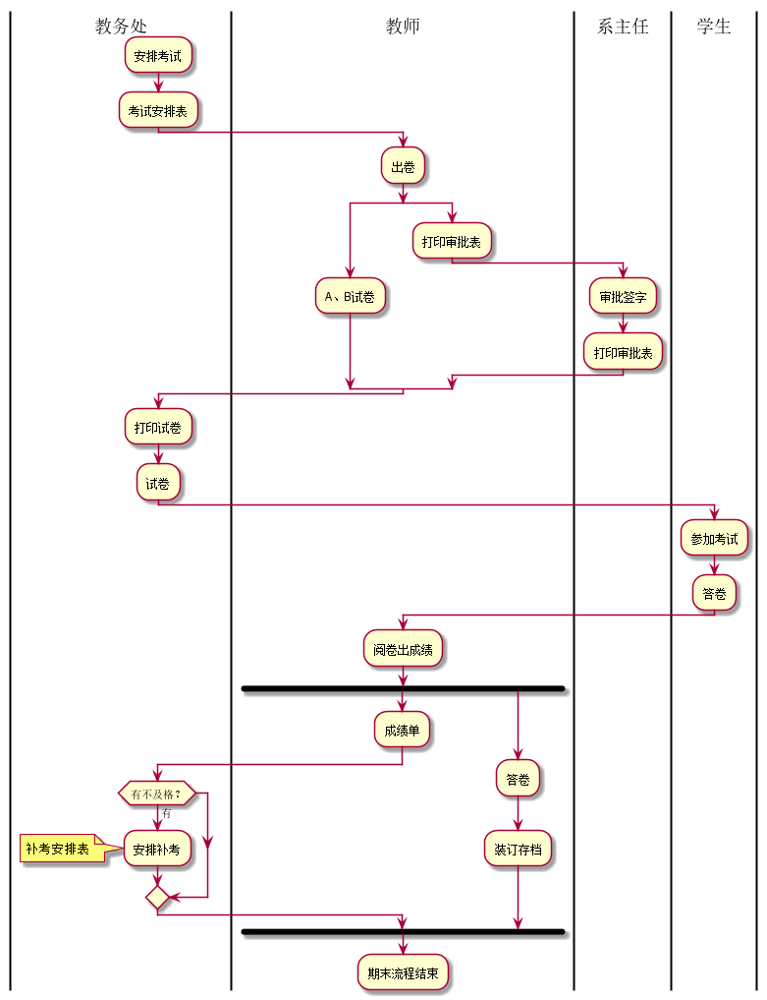
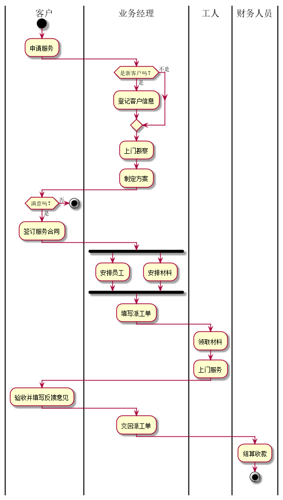

# 实验1：业务流程建模
|学号|班级|姓名|照片|
|:-------:|:-------------: | :----------:|:---:|
|201510414417|软件(本)15-4|魏丹雪||

## 流程图1：考试及成绩管理流程

**PlantUML源码如下：**

``` flow1
@startuml

|教务处|

:安排考试;
:考试安排表;
|教师|
:出卷;
split
:A、B试卷;
split again
:打印审批表;
|系主任|
:审批签字;
:打印审批表;
|教务处|
end split
:打印试卷;

:试卷;

|学生|
:参加考试;
:答卷;
|教师|
:阅卷出成绩;
fork
:成绩单;
|教务处|
if (有不及格？) then (有)
:安排补考;
note left
补考安排表
end note
endif
|教师|
fork again
:答卷;
:装订存档;
end fork
:期末流程结束;
@enduml
```

**业务流程图如下：**



**流程说明：**

考试及成绩管理流程

## 流程图2： 客户维修服务流程

**PlantUML源码如下：**

``` flow2
@startuml

|客户|
start
:申请服务;
|业务经理|
if(是新客户吗？) then (是)
:登记客户信息;
else(不是)
endif
:上门斟察;
:制定方案;
|客户|
if(满意吗？) then (否)
stop
else(是)
:签订服务合同;
|业务经理|
fork
:安排员工;
fork again
:安排材料;
end fork
:填写派工单;
|工人|
:领取材料;
:上门服务;
|客户|
:验收并填写反馈意见;
|业务经理|
:交回派工单;
|财务人员|
:结算收款;
stop

@enduml
```

**业务流程图如下：**



**流程说明：**

客户维修服务流程
