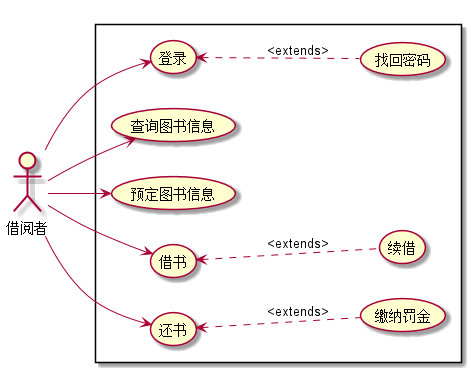
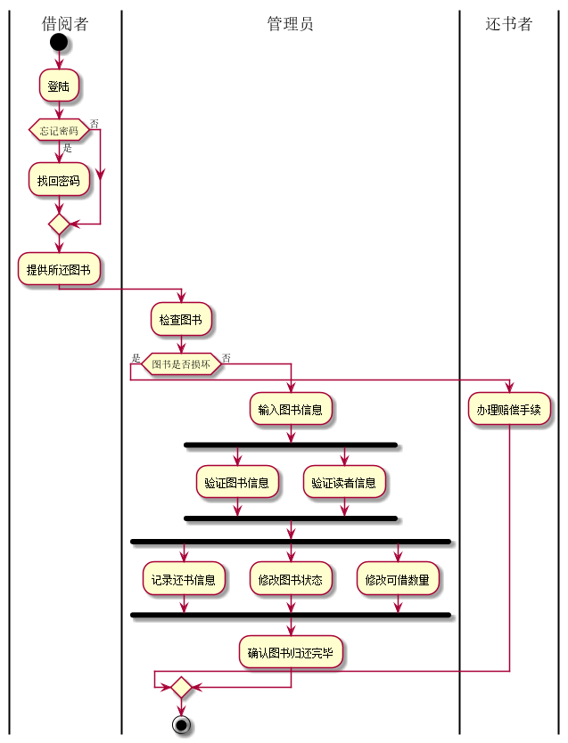

# 实验2：业务流程建模
|学号|班级|姓名|照片|
|:-------:|:-------------: | :----------:|:---:|
|201510414417|软件(本)15-4|魏丹雪||

## 1：图书管理系统的用例关系

### 1.1管理员用例图PlantUML源码如下：

**PlantUML源码如下：**
``` usecase
@startuml
Left to right direction
:管理员:
rectangle {
管理员-->(登录)
管理员-->(查询图书信息)
管理员-->(修改图书信息)
管理员-->(删除图书信息)
管理员-->(借阅管理)
管理员-->(读者管理)
(登录)<..(找回密码):extends
}
@enduml
```
### 1.2 管理员用例图如下：



### 1.3借阅者用例图PlantUML源码如下：

### 1.4 借阅者用例图如下：

## 2. 参与者说明：

###     2.1 借阅者
###     2.2 图书管理员

主要职责是：
* 登陆系统，若遗忘可找回密码；
* 对借阅者进行管理
* 查询图书信息
* 对图书管理系统里的图书数目进行添加，查询，修改和删除操作；
* 收取图书损坏或遗失的罚金。

##     3. 用例规约表
|用例名称|借出图书用例|
|:-------:|:-------------:| 
|参与者|借阅者|
|:-------:|:-------------:|
|用例名|借出图书用例|
|:-------:|:-------------:|

###     3.1 “借出图书”用例

###     3.2 “还书”用例

###     3.1 “预定图书”用例

### 归还图书用例PlantUML图
``` usecase
@startuml
|借阅者|
start
:登陆;
if(忘记密码) then (是)
:找回密码;
else(否)
endif
:提供所还图书;
|管理员|
:检查图书;
if (图书是否损坏) then (是)
|还书者|
:办理赔偿手续;
|管理员|
else(否)
:输入图书信息;
fork
:验证图书信息;
fork again
:验证读者信息;
end fork
fork
:记录还书信息;
fork again
:修改图书状态;
fork again
:修改可借数量;
end fork
|管理员|
:确认图书归还完毕;
endif
stop
@enduml
```

### 还书例图如下：

