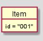
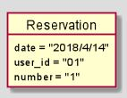
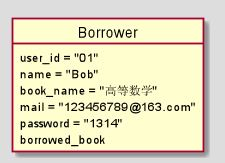
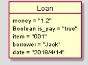
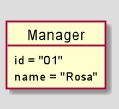
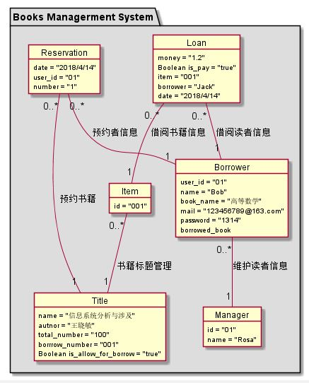

# 实验3：图书管理系统领域对象建模
|学号|班级|姓名|照片|
|:-------:|:-------------: | :----------:|:---:|
|201510414417|软件(本)15-4|魏丹雪||

## 1：图书管理系统的类图

### 1.1类图PlantUML源代码：
```
@startuml
package "Books Managerment System" #DDDDDD{
class Item {
  -create()
  -destroy()
  -find()
  -update()
  -find_on_reservation()
  -find_on_title()
}
class Title {
  -Create()
  -Find()
  -Destroy()
}
class Loan {
   -create()
    -destroy()
    -find()
    -pay()
}
class Reservation {
   -create()
    -destroy()
    -find()
}
class Manager{
     -create()
     -return_book()
     -maintain_borrower_message()
     -maintain_book_message()
 }
class Borrower {
   -create()
    -destroy()
    -find()
    -return_book()
    -check_if_max()
    -borrow_book()
    -modify_password()
}
Item "0..*" -- "1" Title:书籍标题管理
Reservation "0..*" -- "1" Title:预约书籍
Reservation "0..*" -- "1" Borrower:预约者信息
Loan "0..*" -- "1" Borrower:借阅读者信息
Loan "0..*" -- "1" Item:借阅书籍信息
Borrower "0..*" -- "1" Manager:维护读者信息
Item "0..*" -- "1" Manager:维护书籍信息

}
@enduml
```
### 1.2类图如下所示：

### 类图说明：
Title：标题类\
Ttem：书目类\
Reservation：预约类\
Borrower：借阅类\
Loan：借阅记录类\
Manager:管理员类
## 2：图书管理系统的对象图
### 2.1：类Item的对象图：
#### 源码如下所示：
```
object Item {
  id = "001"
}
```
#### 对象图如下所示：

### 2.2：类Reservation的对象图：
#### 源码如下所示：
```
object Reservation {
    date = "2018/4/14"
    user_id = "01"
    number = "1"
}
```
#### 对象图如下所示：

### 2.3：类Borrower的对象图：
#### 源码如下所示：
```
object Borrower {
 user_id = "01"
 name = "Bob"
 book_name = "高等数学"
 mail = "123456789@163.com"
 password = "1314"
 borrowed_book
}
```
#### 对象图如下所示：
### 2.4：类Title的对象图：

#### 源码如下所示：
```
object Title {
  name = "信息系统分析与涉及"
  autnor = "王晓敏"
  total_number = "100"
  borrrow_number = "001"
  Boolean is_allow_for_borrow = "true"
}
```
#### 对象图如下所示：

#### 对象图如下所示：
### 2.5：类Loan的对象图：
#### 源码如下所示：
```
object Loan {
   money = "1.2"
   Boolean is_pay = "true"
   item = "001"
   borrower = "Jack"
   date = "2018/4/14"
}
```
#### 对象图如下所示：

#### 2.6:manager的对象图：
#### 源码如下所示：
```
object Manager{
    id = "01"
    name = "Rosa"
}
```
#### 对象图如下所示：

#### 2.7:系统的对象图：
#### 源码如下所示：
```
@startuml
package "Books Managerment System" #DDDDDD{
object Item {
  id = "001"
}
object Title {
  name = "信息系统分析与涉及"
  autnor = "王晓敏"
  total_number = "100"
  borrrow_number = "001"
  Boolean is_allow_for_borrow = "true"
}
object Loan {
   money = "1.2"
   Boolean is_pay = "true"
   item = "001"
   borrower = "Jack"
   date = "2018/4/14"
}
object Reservation {
    date = "2018/4/14"
    user_id = "01"
    number = "1"
}
object Borrower {
 user_id = "01"
 name = "Bob"
 book_name = "高等数学"
 mail = "123456789@163.com"
 password = "1314"
 borrowed_book
}
object Manager{
    id = "01"
    name = "Rosa"
}
Item "0..*" -- "1" Title:书籍标题管理
Reservation "0..*" -- "1" Title:预约书籍
Reservation "0..*" -- "1" Borrower:预约者信息
Loan "0..*" -- "1" Borrower:借阅读者信息
Loan "0..*" -- "1" Item:借阅书籍信息
Borrower "0..*" -- "1" Manager:维护读者信息
}
@enduml
```
#### 对象图如下所示：


