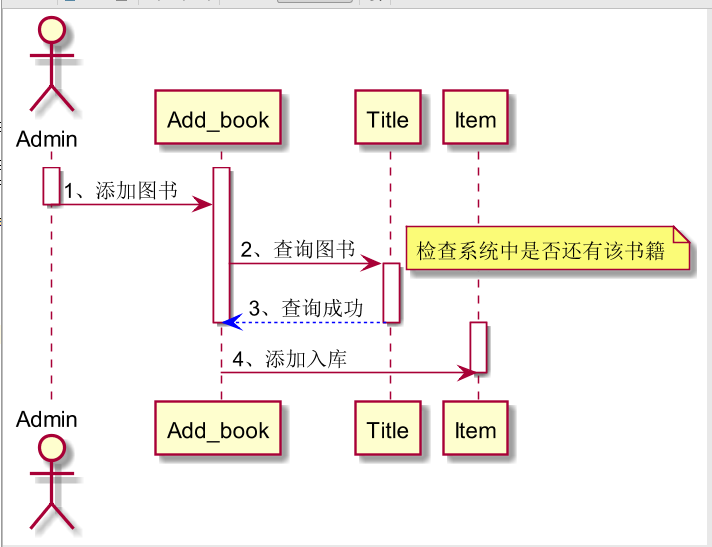
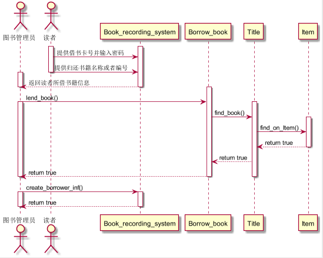
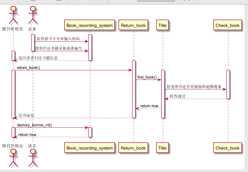
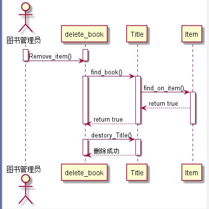

# 实验3：图书管理系统领域对象建模
|学号|班级|姓名|照片|
|:-------:|:-------------: | :----------:|:---:|
|201510414417|软件(本)15-4|魏丹雪||

## 图书管理系统的顺序图

## 1添加图书：

### 1.1PlantUML源代码：
```
@startuml
actor 图书管理员 as Admin
activate Admin
activate Add_book
Admin -> Add_book:1、添加图书
deactivate Admin
Add_book -> Title:2、查询图书
note right:检查系统中是否还有该书籍
activate Title
Add_book <-[#0000FF]- Title:3、查询成功
deactivate Title
deactivate Add_book
activate Item
Add_book -> Item:4、添加入库
deactivate Item
@enduml
```
### 1.2添加图书顺序图：

## 2借阅图书

### 2.1PlantUML源代码：
```
@startuml
actor 图书管理员 as Admin
actor 读者 as Borrower
activate Borrower
activate Book_recording_system
Borrower->Book_recording_system:提供借书卡号并输入密码
Borrower->Book_recording_system:提供归还书籍名称或者编号
deactivate Borrower
activate Admin
Admin<--Book_recording_system:返回读者所借书籍信息
deactivate Book_recording_system
deactivate Admin
activate Borrow_book
Admin->Borrow_book:lend_book()
activate Admin
activate Title
Borrow_book->Title:find_book()
activate Item
Title->Item:find_on_Item()
Title<--Item:return true
deactivate Item
Borrow_book<--Title:return true
Admin<--Borrow_book:return true
deactivate Admin
deactivate Borrow_book
deactivate Title
Admin->Book_recording_system:create_borrower_inf()
activate Admin
activate Book_recording_system
Admin<--Book_recording_system:return true
deactivate Admin
deactivate Book_recording_system
@enduml
```
### 2.2借阅图书顺序图：

### 2.3用例说明：
lend_book():借阅图书\
find_book():查询是否有该图书\
find)on_Item():在图书库中查询图书书目\
create_borrower_inf():创建借书记录
## 3归还图书

### 3.1PlantUML源代码：
```
@startuml
actor 图书管理员 as Admin
actor 读者 as Borrower
activate Borrower
activate Book_recording_system
Borrower->Book_recording_system:提供借书卡号并输入密码
Borrower->Book_recording_system:提供归还书籍名称或者编号
deactivate Borrower
activate Admin
Admin<--Book_recording_system:返回读者归还书籍信息
deactivate Book_recording_system
deactivate Admin
activate Return_book
Admin->Return_book:return_book()
activate Admin
activate Title
activate Check_book
Return_book->Title:find_book()
Title->Check_book:检查图书是否有破损和超期现象
Title<--Check_book:检查通过
deactivate Check_book
Return_book<--Title:return true
Admin<--Return_book:还书成功
deactivate Return_book
deactivate Title
deactivate Admin
Admin->Book_recording_system:destory_borrow_inf()
activate Admin
activate Book_recording_system
Admin<--Book_recording_system:return true
deactivate Admin
deactivate Book_recording_system
@enduml
```
### 3.2归还图书顺序图：

### 3.3用例说明：
return_book():归还图书\
find_book():查询图书库中是否有该图书的记录\
destory_borrow_inf():销毁借书记录
## 4删除图书

### 4.1PlantUML源代码：
```
@startuml
actor 图书管理员 as Admin
activate Admin
activate delete_book
Admin->delete_book:Remove_item()
deactivate Admin
deactivate delete_book
delete_book->Title:find_book()
activate delete_book
activate Title
Title->Item:find_on_item()
activate Item
Title<--Item:return true
delete_book<--Title:return true
deactivate Title
deactivate Item
deactivate delete_book
delete_book->Title:destory_Title()
activate Title
activate delete_book
delete_book<--Title:删除成功
deactivate Title
deactivate delete_book
@enduml
```
### 4.2删除图书顺序图：

### 4.3用例说明：
Remove_book():删除图书\
find_book():查询图书库中是否有该图书的记录\
find_on_item():在图书库中查询图书书目\
destory_book():销毁图书库中该图书的记录
