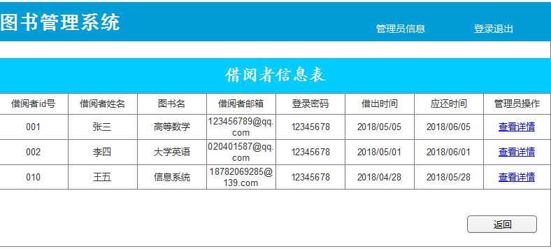

# 实验5：图书管理系统数据库设计与界面设计
|学号|班级|姓名|照片|
|:-------:|:-------------: | :----------:|:---:|
|201510414417|软件(本)15-4|魏丹雪||

## 1.数据库表设计
## 1.1. 管理员表
|字段|类型|主键，外键|可以为空|默认值|约束|说明|
|:-------:|:-------------:|:------:|:----:|:---:|:----:|:-----|
|ID|NUMBER(8,0)|主键|否|||管理员id|
|Name|VARCHAR2(50 BYTE)| |否|||管理员姓名|
## 1.2. 借阅者信息表
|字段|类型|主键，外键|可以为空|默认值|约束|说明|
|:-------:|:-------------:|:------:|:----:|:---:|:----:|:-----|
|Borrow_id|NUMBER(8,0)|主键,外键|否|||借阅者id号|
|Borrow_name|VARCHAR2(50 BYTE)| |否|||借阅者姓名|
|Book_name|VARCHAR2(50 BYTE)| |否|||图书名|
|Mail|VARCHAR2(50 BYTE)| |是|||借阅者邮箱|
|Password|VARCHAR2(512 BYTE)| |否|||密码|
## 1.3. 借阅表
|字段|类型|主键，外键|可以为空|默认值|约束|说明|
|:-------:|:-------------:|:------:|:----:|:---:|:----:|:-----|
|Book_id|NUMBER(8,0)|外键|否|||图书id号|
|money|DOUBLE| |是|||欠费多少|
|Date|DATE| |否|||时间|
|Is_pay|BOOLEAN| |是|||是否付费|
|Borrow_id|NUMBER(8,0)|主键，外键|否|||借阅者id号|
## 1.4. 书籍管理表
|字段|类型|主键，外键|可以为空|默认值|约束|说明|
|:-------:|:-------------:|:------:|:----:|:---:|:----:|:-----|
|Book_id|NUMBER(8,0)|主键,外键|否|||图书id号|
|Book_name|VARCHAR2(50 BYTE)|外键|否|||图书名|
|Book_number|NUMBER(200,0)| |是|||图书数量|
|Author|VARCHAR2(50 BYTE)| |否|||作者|
|Is_allow_for_borrow|BOOLEAN| |否|||是否允许借阅|
|Borrow_number|NUMBER(200,0)| |否|||借出数目|
## 1.5. 预约者信息表
|字段|类型|主键，外键|可以为空|默认值|约束|说明|
|:-------:|:-------------:|:------:|:----:|:---:|:----:|:-----|
|Order_id|NUMBER(8,0)|主键|否|||预约者id号|
|Date|DATE| |否|||预约时间|
|Borrow_number|NUMBER(200,0)| |否|||借出数目|
|Book_name|VARCHAR2(50 BYTE)|外键|否|||图书名|
## 1.6. 书籍题目表
|字段|类型|主键，外键|可以为空|默认值|约束|说明|
|:-------:|:-------------:|:------:|:----:|:---:|:----:|:-----|
|Book_id|NUMBER(8,0)|主键,外键|否|||图书id号|
|Borrow_id|NUMBER(8,0)|外键|否|||借阅者id号|
## 2.数据库表设计
### 2.1借阅者信息表：

- 用例图参见：借阅用例
- 类图参见：借阅者类
- 顺序图参见：借阅图书顺序图
- API接口如下：

1. 借阅者信息API

- 功能：用于获取借阅者的借阅信息
- 请求地址： http://localhost:8080/BookManagementSystem/getBorrowInfo
- 请求方法：POST
- 请求参数：

|参数名称|必填|说明|
|:-------:|:-------------: | :----------:|
|borrow_id|是|读者编号|

- 返回实例：
```
{
    "status_code": "1/0",
    "data": 
    [
        {
            "book_name","大学物理",
            "book_id","ME_2323",
            "book_type","3",
            "author","梅恩",
            "press","成大出版社",
            "price","66.66",
            "borrow_time","2018-10-10 10:10:10",
            "should_r_time","2018-11-10 10:10:10",
        },
    ]
}
```
- 返回参数说明：
    
|参数名称|说明|
|:-------:|:-------------: |
|status_code|状态码（1成功，0失败）|
|data|借阅信息的详细信息|
