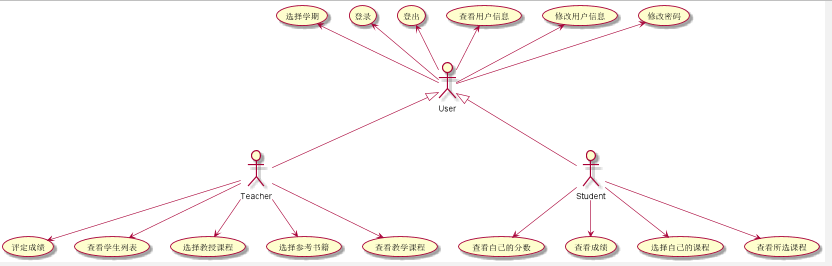
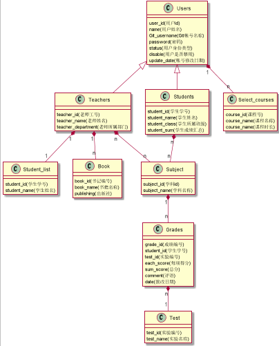

# 实验6：基于Github的实验管理平台的分析与设计
|学号|班级|姓名|照片|
|:-------:|:-------------: | :----------:|:---:|
|201510414417|软件(本)15-4|魏丹雪||
## 1.概述：
## 2.系统整体结构：
## 3.用例图设计：
### 源代码
### 用例图

## 4.类图设计：
### 源代码
### 类图

## 5.数据库设计：
### 源代码
### 数据库表

## 用例以及界面详细设计

