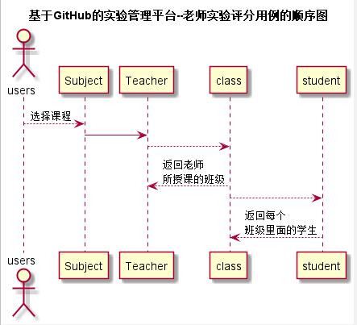
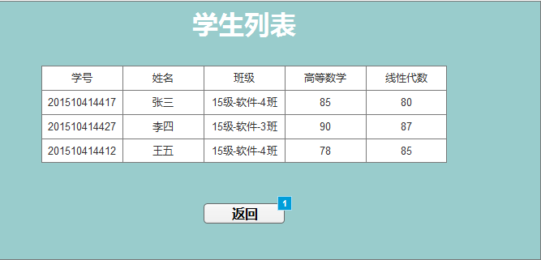

# “学生列表”用例 [返回](./README.md)
## 1. 用例规约

|用例名称|学生列表|
|-------|:-------------|
|功能|老师可在选择班级之后查看一个班的学生列表|
|参与者|老师|
|前置条件|选择班级|
|后置条件| |
|主流事件| |
|备注| |
## 2. 业务流程（顺序图） [源码](../src/student_list.puml)
 
## 3. 界面设计

## 4. 算法描述（活动图）

- STUDNET_LIST解析为列表。
  - STUDNET_LIST为接口getStudentList的返回值，返回值为数组，前台根据数据值进行列表显示。用户名需加上跳转学生作业列表页面的链接，学号、得分直接显示，github用户名显示为github仓库地址，具体仓库由老师具体规定如：https://github.com/acs121/is_analysis。

## 5. 参照表

- [students](../数据库设计.md/#STUDENTS)
- [teachers](../数据库设计.md/#TEACHERS)
- [subject](../数据库设计.md/#Subjects)

## 6. API接口设计

- 接口名称：get_students_list
    
- 功能：
    返回一个班级的学生列表，并返回该学生在该课程中这一学期的课程平均分以及每个学生的选课情况，和学生的github仓库地址。  
    
    该接口服务于：http://202.115.82.8:1522
    
- API请求地址： [getStudent_list](../interface/get_students_list.md)

- 请求方式 ：
    GET  

- 请求参数说明:        
    请求参数为：userId、termId、subjectId、classId，userId参数为用户Id确定用户信息，以便后台查找该用户的相关数据信息。termId确定学期，subjectId确定课程，classId确定班级进而查询出该班级的学生列表。
    
- 返回实例：

        {
            "status": true,
            "student_list"：{
                ["张三"，201510414417,80,weidanxue2],
                ["李四"，201510414408,70，liyue],
                ["王五"，201510414409,90，liujinyi]
            }
        }
  
- 返回参数说明：    
 
  |参数名称|说明|
  |:---------:|:--------------------------------------------------------|      
  |status|bool类型，true表示正确的返回，false表示有错误|
  |student_list|数组类型，数组第一个是学生真是姓名，第二值是学号，第三个值为github用户名|
