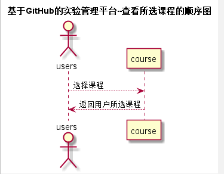

# “学生查看所选课程”用例 [返回](./README.md)
## 1. 用例规约

|用例名称|学生查看所选课程|
|-------|:-------------|
|功能|学生、老师能查看到所选择的课程名称|
|参与者|学生、老师|
|前置条件|已进入到具体的某个用户|
|后置条件| |
|主流事件| |
|备注| |

## 2. 业务流程（顺序图） [源码](../src/watch_course.puml)
 

## 3. 界面设计
界面参照: https://acs121.github.io/is_analysis/test6/index.html

## 4. 算法描述（活动图）

  - LOOK_SUBJECT为接口getSubject的返回值，返回用户选择的课程列表。
## 5. 参照表

- [students](../数据库设计.md/#STUDENTS)
- [subject](../数据库设计.md/#SUBJECTS)
- [teachers](../数据库设计.md/#TEACHERS)
## 6. API接口设计

- 接口名称：getSubject
    
- 功能：
    通过用户id查询用户所选择的课程。
    
    该接口服务于：http://202.115.82.8:1522
    
- API请求地址： 
    http://202.115.82.8:1522/v1/api/getSubject

- 请求方式 ：
    GET  

- 请求参数说明:        
    请求参数为：user_id、subject_id，通过user_id和subject_id查询用户选择的课程。
    
- 返回实例：

        {
            "status": true,
            "subject"：{
                [01,"高等数学"]
                [02,"概率论"]
                [03,"线性代数"]
            }
        }
  
- 返回参数说明：    
 
  |参数名称|说明|
  |:---------:|:--------------------------------------------------------|      
  |status|bool类型，true表示正确的返回，false表示有错误|
  |subject|数组类型，数组中第一个值表示课程编号，第二个值为课程名称|
