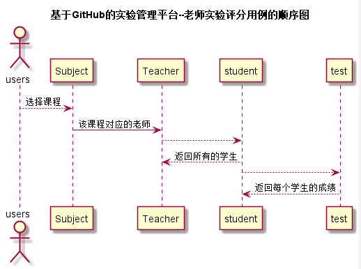

# “评定成绩”用例 [返回](./README.md)
## 1. 用例规约

|用例名称|评定成绩用例|
|-------|:-------------|
|功能|老师添加作业的各个得分项，并为每个学生作业打分|
|参与者|老师|
|前置条件|进入主页，并选择本次学生的作业|
|后置条件| |
|主流事件| |
|备注| |

## 2. 业务流程（顺序图） [源码](../src/evaluate_grade.puml)
 

## 3. 界面设计
界面参照: https://acs121.github.io/is_analysis/test6/index.html

## 4. 算法描述（活动图）

- UI设计。
  - 顶部显示作业题目，页面左边设置添加得分项输入框的按钮，点击一次则生成一个得分项。页面中间为选择班级及选择学生的下拉表单，以确定具体得分对象。右边为单项得分的分数输入框，数量伴随得分项而变化。页面下方设置“提交打分”和“下一个”按钮以及一个评价输入框。点击“提交打分”按钮则完成对该学生的打分，点击“下一个”按钮则自动跳到下一个学生，得分项输入框不发生变化。

## 5. 参照表

- [student](../数据库设计.md/#STUDENTS)
- [teachers](../数据库设计.md/#TEACHERS)
- [subject](../数据库设计.md/#SUBJECTS)
- [test](../数据库设计.md/#TESTS)
- [grades](../数据库设计.md/#GRADES)
## 6. API接口设计

- 接口名称：submitGrades
    
- 功能：
    老师上传给每个学生的作业得分。   
    
    该接口服务于：http://202.115.82.8:1522
    
- API请求地址： 
    http://202.115.82.8:1522/v1/api/submitGrades

- 请求方式 ：
    GET  

- 请求参数说明:        
    请求参数为：student_id，score，test_id。student_id确实学生，test_id确实作业Id，score中包含所有的得分项及得分。
    
- 返回实例：

        {
            "status": true
        }
  
- 返回参数说明：    
 
  |参数名称|说明|
  |:---------:|:--------------------------------------------------------|      
  |status|bool类型，true表示正确的返回，false表示有错误|
