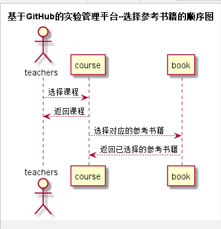
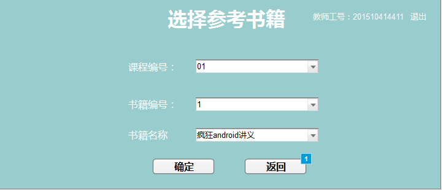

# “选择参考书籍”用例 [返回](./README.md)
## 1. 用例规约

|用例名称|选择参考书籍|
|-------|:-------------|
|功能|老师登录之后需要选择某个课程的参考书籍|
|参与者|学生，老师|
|前置条件|老师需要先登录且已选择课程|
|后置条件| |
|主流事件| |
|备注| |

## 2. 业务流程（顺序图） [源码](../src/select_book.puml)
 

## 3. 界面设计

## 4. 算法描述（活动图）

- 老师用户TEACHER_SELECT_BOOK解析为卡片块。
  - TEACHER_SELECT_BOOK为唯一返回值，返回值为数组，数组元素为课程名称以及对应的参考书籍。

## 5. 参照表

- [teachers](../数据库设计.md/#TEACHERS)
- [subject](../数据库设计.md/#SUBJECTS)
- [book](../数据库设计.md/#BOOK)
## 6. API接口设计

- 接口名称：select_reference_book
    
- 功能：
    返回该用户所存在课程的课程列表。   
    
    该接口服务于：http://202.115.82.8:1522
    
- API请求地址： 
    [select_reference_book](../interface/select_reference_book.md)
- 请求方式 ：
    GET  

- 请求参数说明:        
    请求有三个参数：teacher_id、subject_id、book_id，teacher_id参数为老师id确定老师信息，以便后台查找该用户的相关数据信息。subject_id确定课程，进一步选择书籍，book_id为所选书籍的id。
    
- 返回实例：

        {
            "status": true,
            "book"：[
                "高等数学18讲",
                "线性代数9讲",
                "概率论9讲"
            ]
        }
  
- 返回参数说明：    
 
  |参数名称|说明|
  |:---------:|:--------------------------------------------------------|      
  |status|bool类型，true表示正确的返回，false表示有错误|
  |book|数组类型，元素表示书籍名称|
